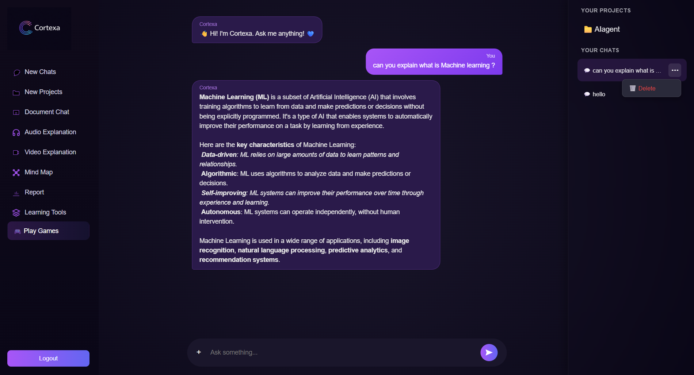
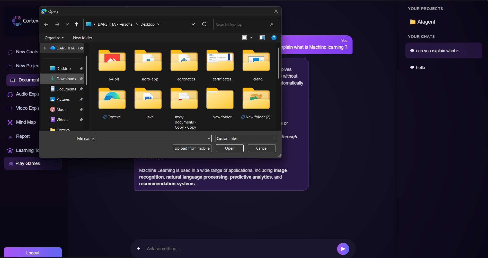

# REVIEW OF CORTEXA

## Project Overview

Cortexa is a modern web application designed to provide an efficient and user-friendly experience.

## Screenshots

### Home Page

### Dashboard

### Registration Form

### Login Page

### User Profile

### Feature Screen 1

### Feature Screen 2

### Feature Screen 3

### Feature Screen 4

### Feature Screen 5

### Feature Screen 6

### Feature Screen 7

### Feature Screen 8

### Feature Screen 9

### Feature Screen 10

### Feature Screen 11

## Conclusion

The screenshots demonstrate the application's interface, features, and overall user experience. Cortexa provides a clean design, responsive layout, and functional workflow.
