# REVIEW OF CORTEXA

## Project Overview

Cortexa is a modern web application designed to provide an efficient and user-friendly experience.

## Screenshots

### Home Page

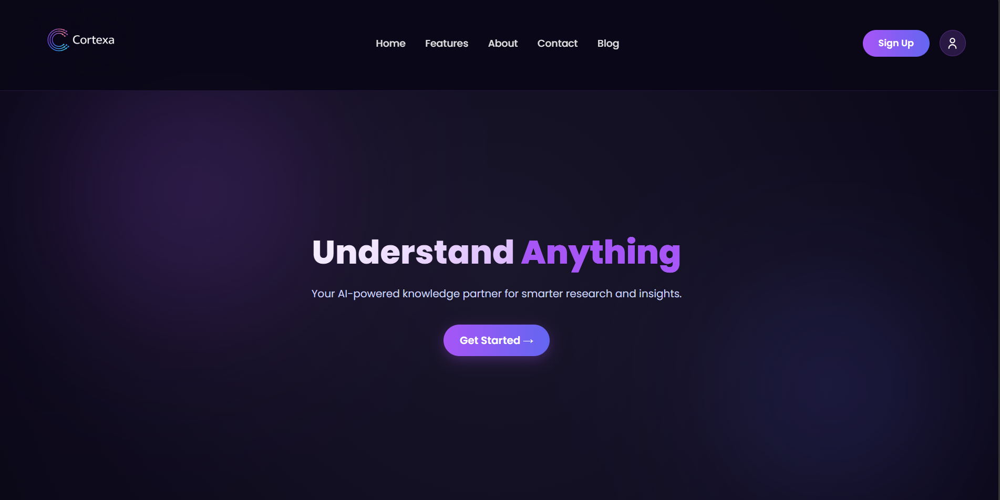

### Dashboard

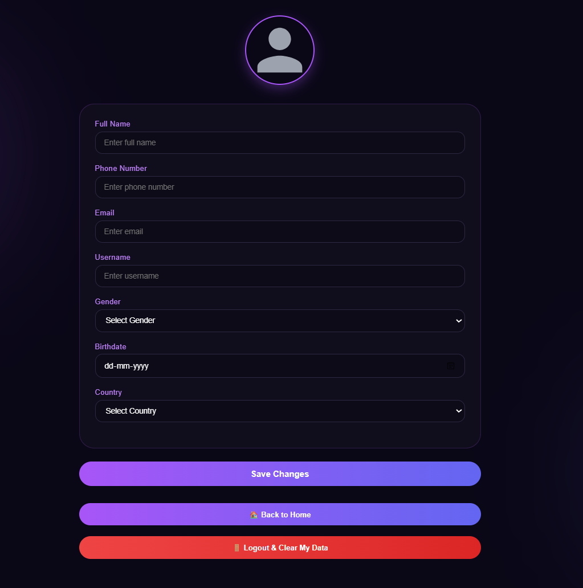

### Registration Form

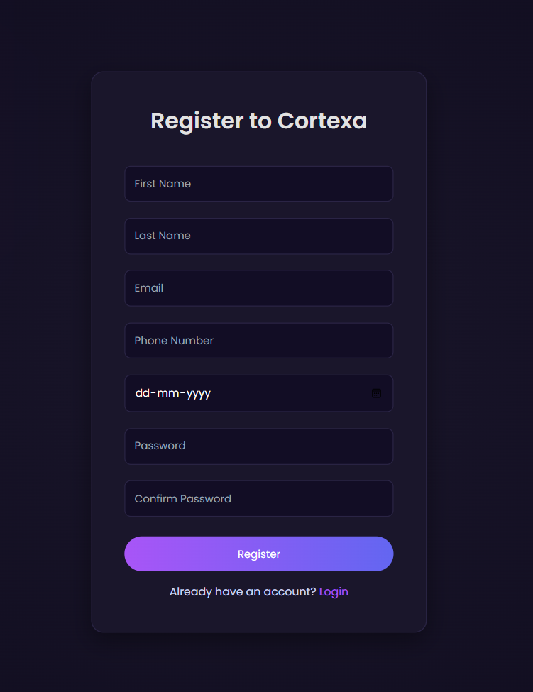

### Login Page

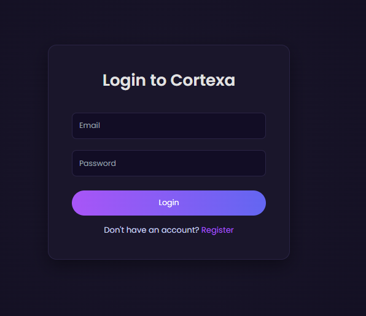

### User Profile

### Feature Screen 

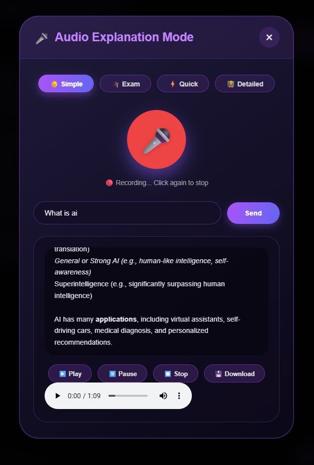

### Feature Screen 

### Feature Screen 

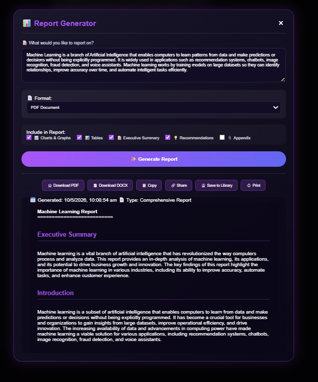

### Feature Screen 

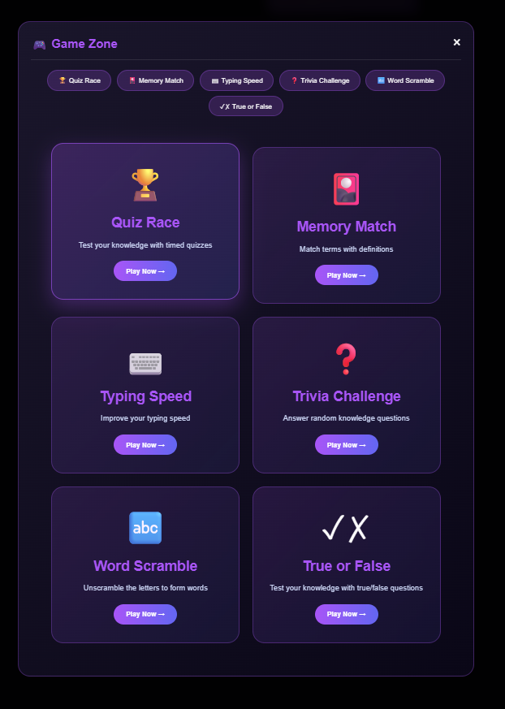

### Feature Screen 

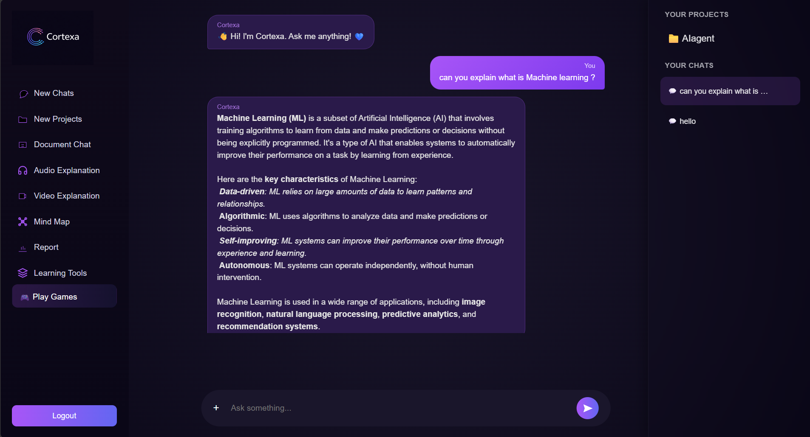

### Feature Screen 

### Feature Screen 

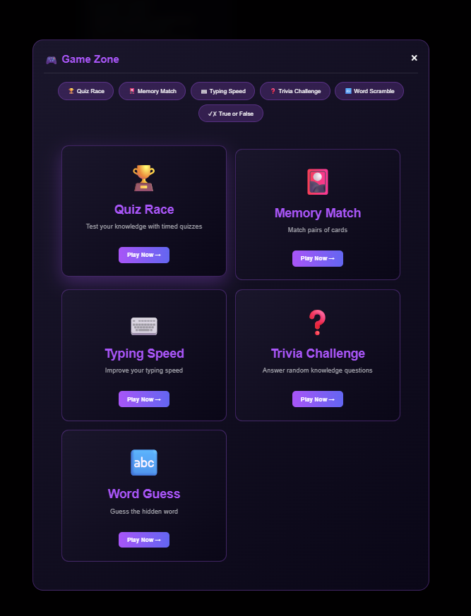

### Feature Screen 

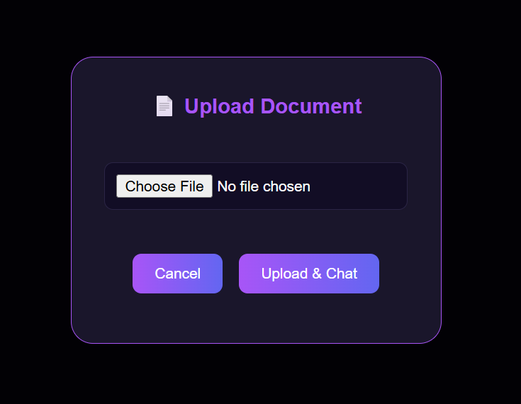

### Feature Screen 

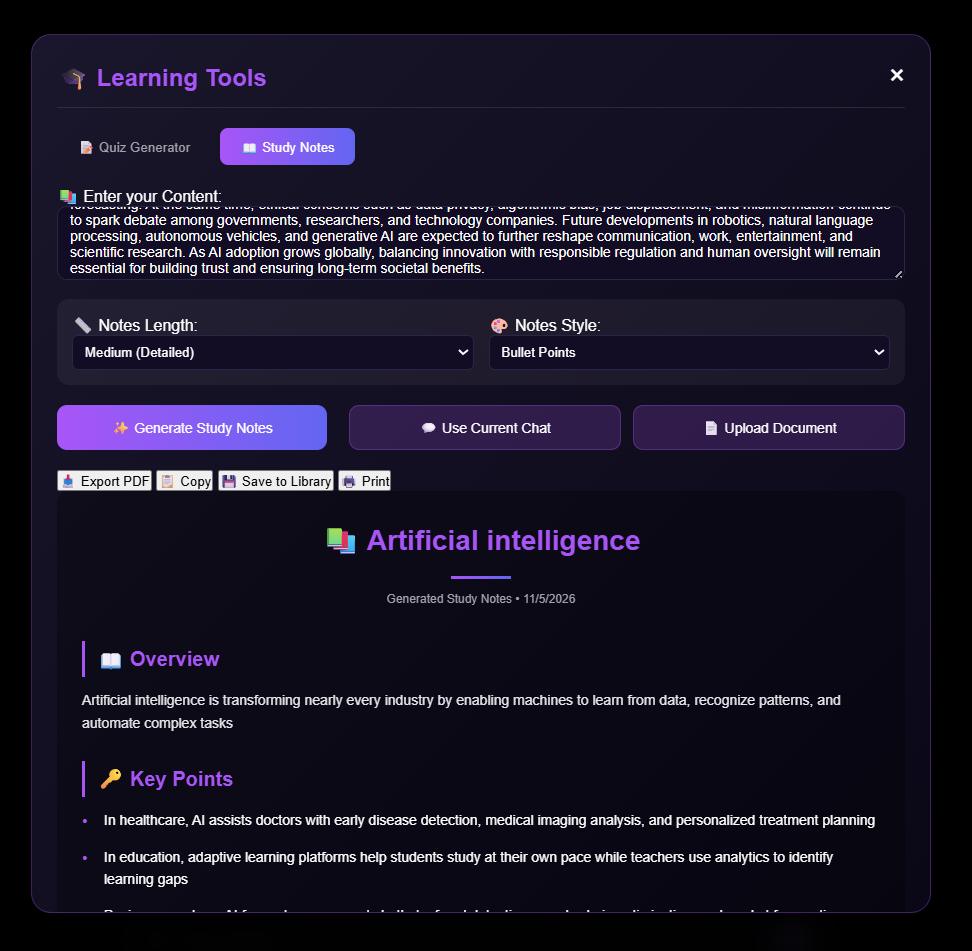

## Conclusion

The screenshots demonstrate the application's interface, features, and overall user experience. Cortexa provides a clean design, responsive layout, and functional workflow.
